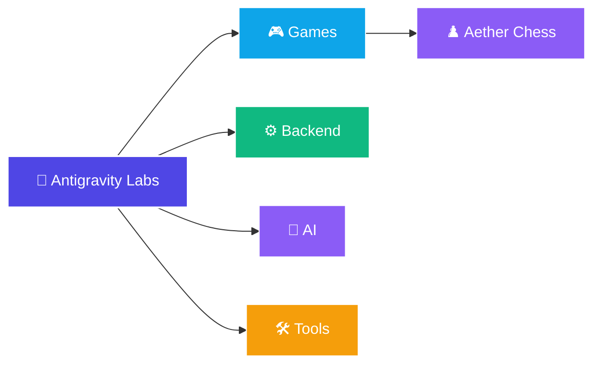

# 🛸 Antigravity Labs

Repositório de projetos pessoais voltados para aprendizado, experimentação e desenvolvimento de software utilizando o antigravity.

Aqui ficam jogos, ferramentas, APIs, automações e qualquer outra ideia que pareça interessante de construir.

Este repositório foi estruturado para organizar os projetos por escopo de desenvolvimento, facilitando o gerenciamento do código e a modularidade de novas soluções.

---

## 📂 Estrutura do Repositório

```text
antigravity-labs/
├── ai/          # Projetos e modelos envolvendo Inteligência Artificial (.gitkeep)
├── backend/     # APIs, microsserviços e utilitários de servidor (.gitkeep)
├── games/       # Jogos interativos e experiências visuais
│   └── chess/   # Aether Chess - Xadrez Premium com IA local
└── tools/       # Ferramentas, scripts de automação e utilitários (.gitkeep)
```

Abaixo está a visualização geral do repositório para novos projetos:



---

## 🎮 Projetos Disponíveis

### Games (Jogos)

| Projeto | Caminho | Status | Descrição | Tecnologias |
| :--- | :--- | :--- | :--- | :--- |
| **Aether Chess ♟️** | [games/chess](./games/chess) | `Concluído` | Xadrez premium contra IA minimax local, glassmorphism, áudio sintetizado offline e suporte a temas. | HTML5, CSS3, JS, Python |

> Para detalhes completos sobre recursos e o motor de inteligência artificial do xadrez, consulte a documentação dedicada em [README.md](./games/chess/README.md).

---

## 🚀 Como Executar

### ♟️ Rodando o Aether Chess
O servidor local de xadrez pode ser inicializado diretamente a partir da raiz do repositório:

```bash
python games/chess/server.py
```

Após rodar o comando, abra o navegador em: [http://localhost:8000/](http://localhost:8000/)

---

## ⚙️ Tecnologias

O repositório é agnóstico de stack, utilizando a tecnologia mais apropriada para cada caso:

* **Frontend:** HTML5, CSS3 Vanilla, JavaScript Moderno (ES6+)
* **Backend:** Python (FastAPI, Flask, http.server), SQLite
* **IA/Algoritmos:** Algoritmos de busca (Minimax, Alpha-Beta), heurísticas posicionais e caching avançado
* **Integrações:** Web Audio API, Canvas, Confetti CSS

---

## 📄 Licença

Este projeto está sob a licença MIT. Veja [LICENSE](./LICENSE) para mais detalhes.
