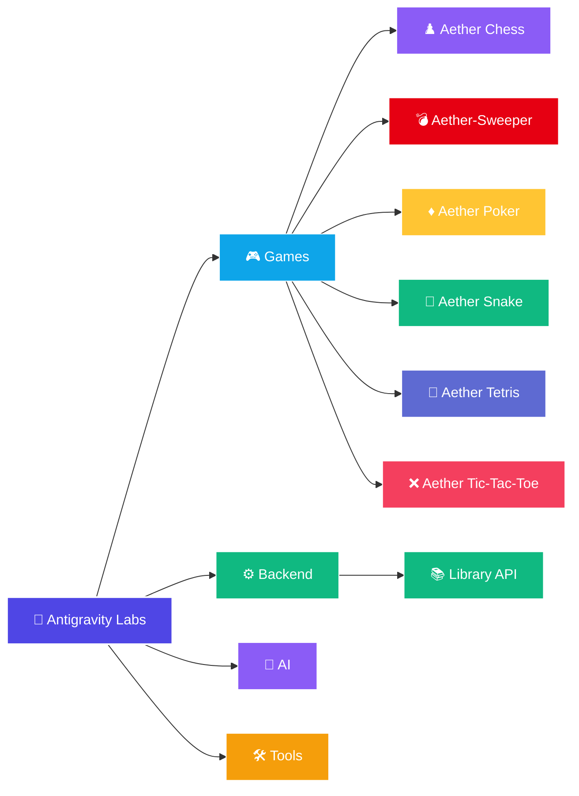

# 🛸 Antigravity Labs

Repositório de projetos pessoais voltados para aprendizado, experimentação e desenvolvimento de software utilizando o antigravity.

Aqui ficam jogos, ferramentas, APIs, automações e qualquer outra ideia que pareça interessante de construir.

Este repositório foi estruturado para organizar os projetos por escopo de desenvolvimento, facilitando o gerenciamento do código e a modularidade de novas soluções.

---

## 📂 Estrutura do Repositório

```text
antigravity-labs/
├── ai/          # Projetos e modelos envolvendo Inteligência Artificial (.gitkeep)
├── backend/     # APIs, microsserviços e utilitários de servidor
│   └── library_api/ # API de Biblioteca (FastAPI, SQLite, SQLAlchemy)
├── games/       # Jogos interativos e experiências visuais
│   ├── chess/   # Aether Chess - Xadrez Premium com IA local
│   ├── minesweeper/ # Aether-Sweeper - Campo Minado 8-Bit Retro Arcade
│   ├── poker/   # Aether Poker - Texas Hold'em com bots inteligentes e side pots
│   ├── snake/   # Aether Snake - Cobrinha com IA Autopilot (BFS + Cauda) e modo Manual
│   └── tetris/  # Aether Tetris - Tetris Premium inspirado no design da Linear.app
└── tools/       # Ferramentas, scripts de automação e utilitários (.gitkeep)
```

Abaixo está a visualização geral do repositório para novos projetos:



---

## 🎮 Projetos Disponíveis

### Games (Jogos)

| Projeto | Caminho | Status | Descrição | Tecnologias |
| :--- | :--- | :--- | :--- | :--- |
| **Aether Chess ♟️** | [games/chess](./games/chess) | `Concluído` | Xadrez premium contra IA minimax local, glassmorphism, áudio sintetizado offline e suporte a temas. | HTML5, CSS3, JS, Python |
| **Aether-Sweeper 💣** | [games/minesweeper](./games/minesweeper) | `Concluído` | Campo Minado com estética 8-bit retro arcade, primeiro clique seguro, chording, rumbles de explosão, confetes e som sintetizado offline. | HTML5, CSS3, JS, Python |
| **Aether Tetris 🌌** | [games/tetris](./games/tetris) | `Concluído` | Jogo de Tetris premium inspirado no design da Linear.app. Conta com 3 modos (Clássico, Contrarrelógio e Zen), seleção de níveis e áudio chiptune sintetizado offline. | HTML5, CSS3, JS, Python |
| **Aether Poker ♦️** | [games/poker](./games/poker) | `Concluído` | Jogo de Texas Hold'em premium com bots de perfis psicológicos (shark, fish, caller), side pots robustos e áudio sintetizado. | HTML5, CSS3, JS, Python |
| **Aether Snake 🐍** | [games/snake](./games/snake) | `Concluído` | Jogo da cobrinha com IA de busca de caminho (BFS + segurança e desvio de cauda) ou manual. | HTML5, CSS3, JS, Python |
| **Aether Tic-Tac-Toe ❌** | [games/tictactoe](./games/tictactoe) | `Concluído` | Jogo da velha com IA Minimax e Poda Alpha-Beta, modo PvP local, simulação e áudio sintetizado offline. | HTML5, CSS3, JS, Python |

> Para detalhes completos sobre os jogos, consulte suas respectivas documentações.

### Backend (APIs e Microsserviços)

| Projeto | Caminho | Status | Descrição | Tecnologias |
| :--- | :--- | :--- | :--- | :--- |
| **Library API 📚** | [backend/library_api](./backend/library_api) | `Em Desenvolvimento (Etapa 2)` | API RESTful para gerenciamento de biblioteca (livros, autores, categorias). | Python, FastAPI, SQLite, SQLAlchemy, Pytest |

---

## 🚀 Como Executar

O repositório agora utiliza um **Servidor Central Unificado** em Python para servir todos os jogos e um Painel Dashboard Launcher na raiz.

### Inicializando o Servidor Central
Execute a partir do diretório raiz:

```bash
python server.py
```

Acesse no navegador:
- **Painel Dashboard Launcher (Central)**: [http://localhost:8000/](http://localhost:8000/)
- **Aether Chess**: [http://localhost:8000/games/chess/](http://localhost:8000/games/chess/)
- **Aether-Sweeper**: [http://localhost:8000/games/minesweeper/](http://localhost:8000/games/minesweeper/)
- **Aether Poker**: [http://localhost:8000/games/poker/](http://localhost:8000/games/poker/)
- **Aether Snake**: [http://localhost:8000/games/snake/](http://localhost:8000/games/snake/)
- **Aether Tetris**: [http://localhost:8000/games/tetris/](http://localhost:8000/games/tetris/)
- **Aether Tic-Tac-Toe**: [http://localhost:8000/games/tictactoe/](http://localhost:8000/games/tictactoe/)

---

## ⚙️ Tecnologias

O repositório é agnóstico de stack, utilizando a tecnologia mais apropriada para cada caso:

* **Frontend:** HTML5, CSS3 Vanilla, JavaScript Moderno (ES6+)
* **Backend:** Python (FastAPI, Flask, http.server), SQLite
* **IA/Algoritmos:** Algoritmos de busca (Minimax, Alpha-Beta), heurísticas posicionais e caching avançado
* **Integrações:** Web Audio API, Canvas, Confetti CSS

---

## 📄 Licença

Este projeto está sob a licença MIT. Veja [LICENSE](./LICENSE) para mais detalhes.
