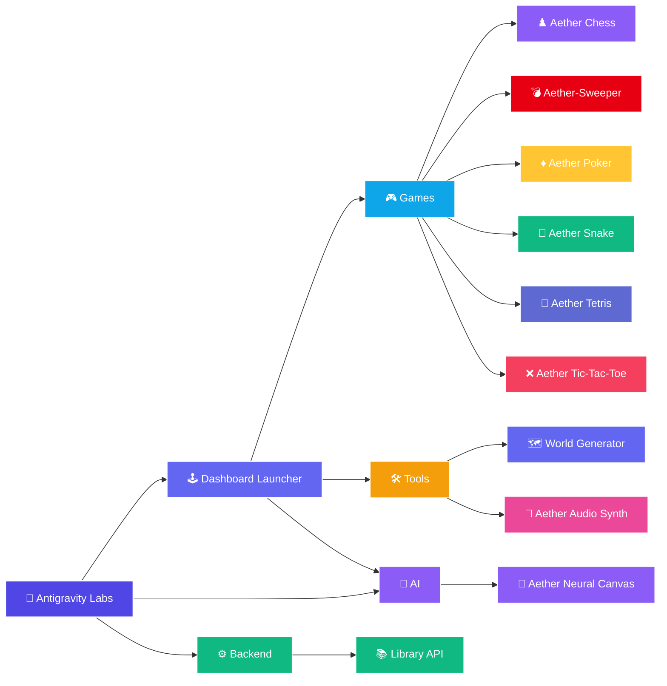

# 🛸 Antigravity Labs

Repositório de projetos pessoais voltados para aprendizado, experimentação e desenvolvimento de software utilizando o antigravity.

Aqui ficam jogos, ferramentas, APIs, automações e qualquer outra ideia que pareça interessante de construir.

Este repositório foi estruturado para organizar os projetos por escopo de desenvolvimento, facilitando o gerenciamento do código e a modularidade de novas soluções.

---

## 📂 Estrutura do Repositório

```text
antigravity-labs/
├── index.html   # Painel Dashboard Launcher (Central)
├── server.py    # Servidor Central Unificado em Python
├── ai/          # Projetos e modelos envolvendo Inteligência Artificial
│   └── neural_canvas/ # Aether Neural Canvas - Reconhecimento de desenhos em tempo real (TensorFlow.js)
├── backend/     # APIs, microsserviços e utilitários de servidor
│   └── library_api/ # API de Biblioteca (FastAPI, SQLite, SQLAlchemy)
├── games/       # Jogos interativos e experiências visuais
│   ├── chess/   # Aether Chess - Xadrez Premium com IA local
│   ├── minesweeper/ # Aether-Sweeper - Campo Minado 8-Bit Retro Arcade
│   ├── poker/   # Aether Poker - Texas Hold'em com bots inteligentes e side pots
│   ├── snake/   # Aether Snake - Cobrinha com IA Autopilot (BFS + Cauda) e modo Manual
│   ├── tetris/  # Aether Tetris - Tetris Premium inspirado no design da Linear.app
│   └── tictactoe/ # Aether Tic-Tac-Toe - Jogo da Velha com IA Minimax
└── tools/       # Ferramentas, scripts de automação e utilitários
    ├── aether_synth/ # Aether Audio Synth - Estúdio de Síntese Modular (FM/AM), Gerador 8-Bit sfxr, Tracker, FX & Performance
    └── world_generation/ # Gerador Procedural de Mundos (Fase 6: Visualização 3D)
```

Abaixo está a visualização geral do repositório para novos projetos:


```mermaid
flowchart LR
    Root["🚀 Antigravity Labs"]
    Launcher["🕹️ Dashboard Launcher"]

    Root --> Launcher
    Root --> Backend["⚙️ Backend"]
    Root --> AI["🤖 AI"]

    Launcher --> Games["🎮 Games"]
    Launcher --> Tools["🛠️ Tools"]
    Launcher --> AI["🤖 AI"]

    Games --> Chess["♟️ Aether Chess"]
    Games --> Sweeper["💣 Aether-Sweeper"]
    Games --> Poker["♦️ Aether Poker"]
    Games --> Snake["🐍 Aether Snake"]
    Games --> Tetris["🌌 Aether Tetris"]
    Games --> TicTacToe["❌ Aether Tic-Tac-Toe"]

    Backend --> LibraryAPI["📚 Library API"]
    
    Tools --> WorldGen["🗺️ World Generator"]
    Tools --> AudioSynth["🎹 Aether Audio Synth"]

    AI --> NeuralCanvas["🎨 Aether Neural Canvas"]

    style Root fill:#4f46e5,stroke:#fff,stroke-width:2px,color:#fff
    style Launcher fill:#6366f1,stroke:#fff,stroke-width:1.5px,color:#fff
    style Games fill:#0ea5e9,stroke:#fff,stroke-width:1px,color:#fff
    style Backend fill:#10b981,stroke:#fff,stroke-width:1px,color:#fff
    style AI fill:#8b5cf6,stroke:#fff,stroke-width:1px,color:#fff
    style Tools fill:#f59e0b,stroke:#fff,stroke-width:1px,color:#fff
    style Chess fill:#8b5cf6,stroke:#fff,stroke-width:1px,color:#fff
    style Sweeper fill:#e60012,stroke:#fff,stroke-width:1px,color:#fff
    style Poker fill:#ffc533,stroke:#fff,stroke-width:1px,color:#fff
    style Snake fill:#10b981,stroke:#fff,stroke-width:1px,color:#fff
    style Tetris fill:#5e6ad2,stroke:#fff,stroke-width:1px,color:#fff
    style TicTacToe fill:#f43f5e,stroke:#fff,stroke-width:1px,color:#fff
    style LibraryAPI fill:#10b981,stroke:#fff,stroke-width:1px,color:#fff
    style WorldGen fill:#6366f1,stroke:#fff,stroke-width:1px,color:#fff
    style AudioSynth fill:#ec4899,stroke:#fff,stroke-width:1px,color:#fff
    style NeuralCanvas fill:#8b5cf6,stroke:#fff,stroke-width:1px,color:#fff
```

---

## 🎮 Projetos Disponíveis

### Games (Jogos)

| Projeto | Caminho | Status | Descrição | Tecnologias |
| :--- | :--- | :--- | :--- | :--- |
| **Aether Chess ♟️** | [games/chess](./games/chess) | `Concluído` | Xadrez premium contra IA minimax local, glassmorphism, áudio sintetizado offline e suporte a temas. | HTML5, CSS3, JS, Python |
| **Aether-Sweeper 💣** | [games/minesweeper](./games/minesweeper) | `Concluído` | Campo Minado com estética 8-bit retro arcade, primeiro clique seguro, chording, rumbles de explosão, confetes e som sintetizado offline. | HTML5, CSS3, JS, Python |
| **Aether Tetris 🌌** | [games/tetris](./games/tetris) | `Concluído` | Jogo de Tetris premium inspirado no design da Linear.app. Conta com 3 modos (Clássico, Contrarrelógio e Zen), seleção de níveis e áudio chiptune sintetizado offline. | HTML5, CSS3, JS, Python |
| **Aether Poker ♦️** | [games/poker](./games/poker) | `Concluído` | Jogo de Texas Hold'em premium com bots de perfis psicológicos (shark, fish, caller), side pots robustos e áudio sintetizado. | HTML5, CSS3, JS, Python |
| **Aether Snake 🐍** | [games/snake](./games/snake) | `Concluído` | Jogo da cobrinha com IA de busca de caminho (BFS + segurança e desvio de cauda) ou manual. | HTML5, CSS3, JS, Python |
| **Aether Tic-Tac-Toe ❌** | [games/tictactoe](./games/tictactoe) | `Concluído` | Jogo da velha com IA Minimax e Poda Alpha-Beta, modo PvP local, simulação e áudio sintetizado offline. | HTML5, CSS3, JS, Python |

> Para detalhes completos sobre os jogos, consulte suas respectivas documentações.

### AI (Inteligência Artificial)

| Projeto | Caminho | Status | Descrição | Tecnologias |
| :--- | :--- | :--- | :--- | :--- |
| **Aether Neural Canvas 🎨** | [ai/neural_canvas](./ai/neural_canvas) | `Concluído` | Tela de desenho com IA local que classifica traços em tempo real via rede neural (DoodleNet), com modos Sandbox e Time Attack e sons sintetizados. | HTML5, CSS3, JS, TensorFlow.js, Python |

### Backend (APIs e Microsserviços)

| Projeto | Caminho | Status | Descrição | Tecnologias |
| :--- | :--- | :--- | :--- | :--- |
| **Library API 📚** | [backend/library_api](./backend/library_api) | `Concluído` | API RESTful para gerenciamento de biblioteca (catálogo de livros, controle de leitores, autenticação JWT e gestão atômica de empréstimos/devoluções). | Python, FastAPI, SQLite, SQLAlchemy, PyJWT, Pytest |

### Tools (Ferramentas)

| Projeto | Caminho | Status | Descrição | Tecnologias |
| :--- | :--- | :--- | :--- | :--- |
| **Aether Audio Synth 🎹** | [tools/aether_synth](./tools/aether_synth) | `Concluído` | Estúdio de síntese de áudio retro em Web Audio API: Síntese Modular Dual (FM/AM), Gerador SFX 8-Bit (sfxr), Sequenciador 16 passos, Tracker / Arranjador de Músicas, Efeitos (Stereo Delay & Space Reverb), Mixer 5 faixas (Mute/Solo), Teclado Virtual QWERTY/MIDI, Osciloscópio & Espectrograma FFT CRT e exportação WAV/JSON. | HTML5, CSS3, JS, Web Audio API, Web MIDI API, Canvas |
| **World Generator 🗺️** | [tools/world_generation](./tools/world_generation) | `Concluído` | Gerador procedural de mundos 2D e 3D (Three.js) com relevo, rios, reinos, estradas (A*), recursos, simulação histórica interativa (logs clicáveis, timeline, partículas 3D) e exportação completa em JSON. | HTML5, CSS3, JS, Three.js, Python |

---

## 🚀 Como Executar

O repositório utiliza um **Servidor Central Unificado** em Python para servir todos os projetos e um Painel Dashboard Launcher na raiz. O Dashboard Launcher oferece navegação dinâmica e categorizada entre **Games (Jogos)** e **Tools (Ferramentas)**.

### Inicializando o Servidor Central
Execute a partir do diretório raiz:

```bash
python server.py
```

Acessee no navegador:
*   **Painel Dashboard Launcher (Central)**: [http://localhost:8000/](http://localhost:8000/) — Interface unificada com categorias:
    *   **Jogos (Games)**: Aether Chess, Aether-Sweeper, Aether Tetris, Aether Snake, Aether Tic-Tac-Toe e Aether Poker.
    *   **Ferramentas (Tools)**: Aether Audio Synth e World Generator.
    *   **Inteligência Artificial (AI)**: Aether Neural Canvas.
*   **Aether Audio Synth**: [http://localhost:8000/tools/aether_synth/](http://localhost:8000/tools/aether_synth/) (Acesso direto)
*   **Aether Neural Canvas**: [http://localhost:8000/ai/neural_canvas/](http://localhost:8000/ai/neural_canvas/) (Acesso direto)
*   **Aether Chess**: [http://localhost:8000/games/chess/](http://localhost:8000/games/chess/) (Acesso direto)
*   **Aether-Sweeper**: [http://localhost:8000/games/minesweeper/](http://localhost:8000/games/minesweeper/) (Acesso direto)
*   **Aether Poker**: [http://localhost:8000/games/poker/](http://localhost:8000/games/poker/) (Acesso direto)
*   **Aether Snake**: [http://localhost:8000/games/snake/](http://localhost:8000/games/snake/) (Acesso direto)
*   **Aether Tetris**: [http://localhost:8000/games/tetris/](http://localhost:8000/games/tetris/) (Acesso direto)
*   **Aether Tic-Tac-Toe**: [http://localhost:8000/games/tictactoe/](http://localhost:8000/games/tictactoe/) (Acesso direto)
*   **World Generator**: [http://localhost:8000/tools/world_generation/](http://localhost:8000/tools/world_generation/) (Acesso direto)

---

## ⚙️ Tecnologias

O repositório é agnóstico de stack, utilizando a tecnologia mais apropriada para cada caso:

*   **Frontend:** HTML5, CSS3 Vanilla, JavaScript Moderno (ES6+)
*   **Backend:** Python (FastAPI, Flask, http.server), SQLite
*   **IA/Algoritmos:** Algoritmos de busca (Minimax, Alpha-Beta), heurísticas posicionais e caching avançado
*   **Integrações:** Web Audio API, Canvas, Confetti CSS

---

## 📄 Licença

Este projeto está sob a licença MIT. Veja [LICENSE](./LICENSE) para mais detalhes.
