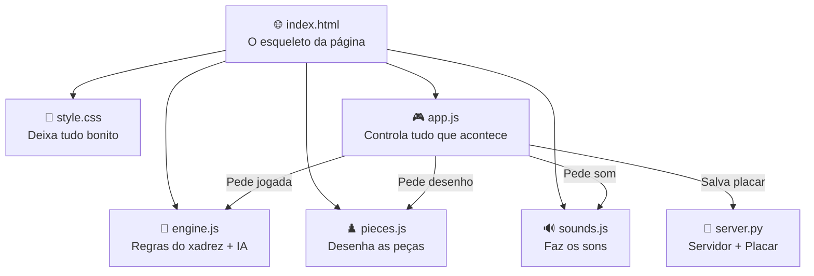
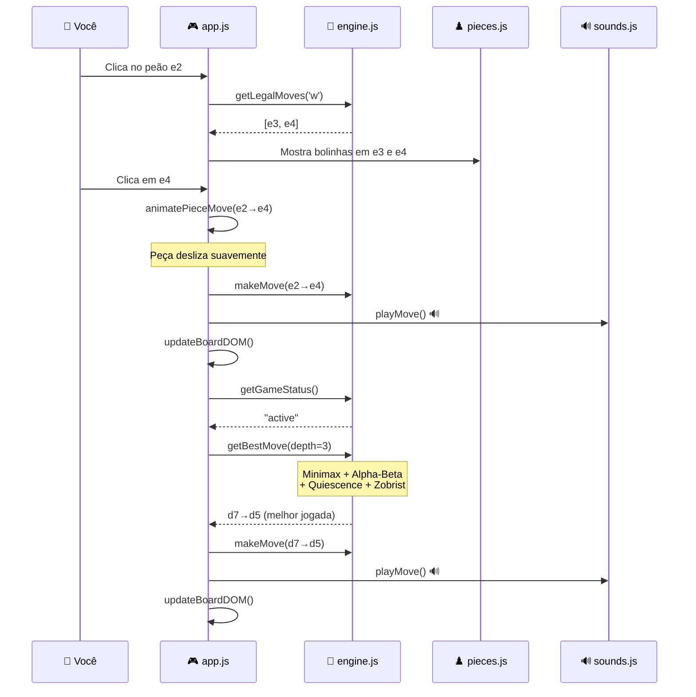
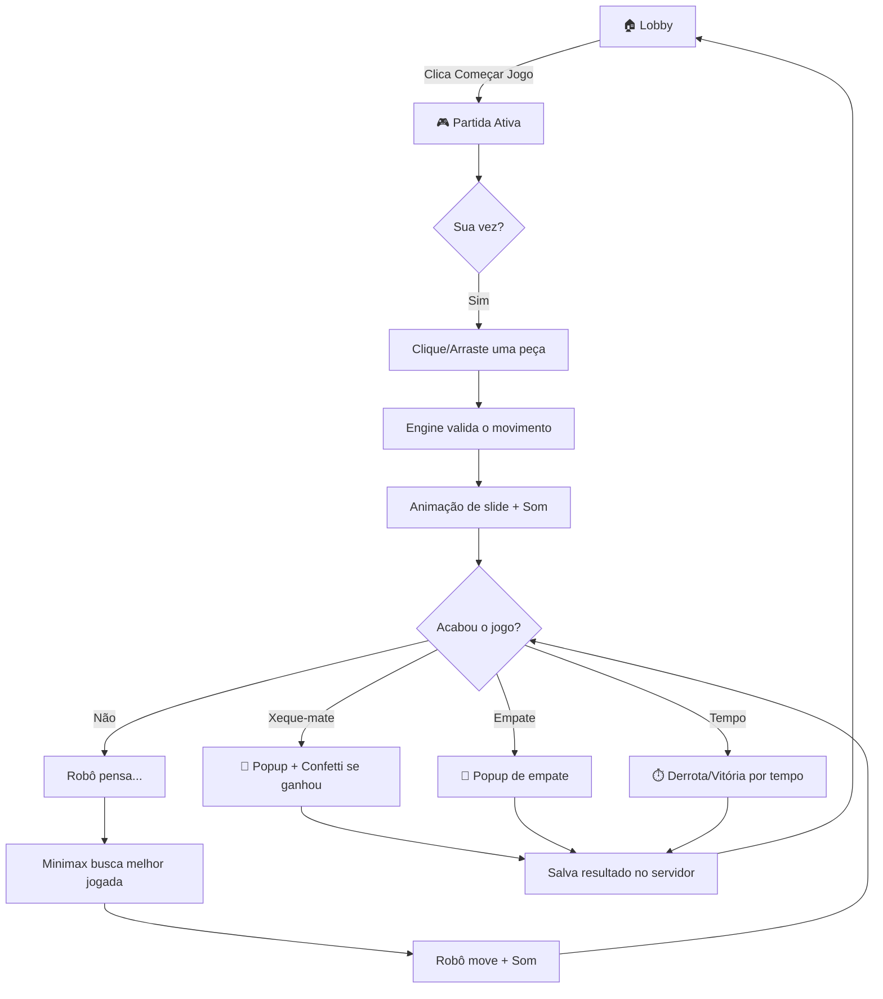

# 🐴 Como Funciona o Aether Chess — Explicação Simples

> Imagina que o jogo é um **restaurante**. O HTML é o **prédio** (mesas, cadeiras, decoração). O CSS é a **pintura e iluminação** (deixa bonito). O JavaScript é o **garçom + cozinheiro** (faz tudo funcionar). O Python é o **caixa** (guarda o placar). Agora vamos ver cada parte.

---

## 📁 A Estrutura Geral — "Quem faz o quê?"



### Em palavras simples:

1. **index.html** → É o "esqueleto". Diz: "Aqui vai o tabuleiro, aqui vai o botão, aqui vai o placar". Mas ele sozinho é só texto — não faz nada.

2. **style.css** → É a "roupa". Pega o esqueleto e diz: "O tabuleiro é quadrado, as casas claras são brancas, as escuras são cinzas, os botões são roxos com brilho". Sem ele, seria tudo feio e sem cor.

3. **engine.js** → É o **cérebro**. Sabe TODAS as regras do xadrez: como cada peça anda, o que é roque, en passant, xeque-mate, empate. E também é a **inteligência artificial** que decide as jogadas do robô.

4. **app.js** → É o **gerente geral**. Conecta tudo. Quando você clica numa peça, o app.js pergunta ao engine.js "quais movimentos são válidos?", depois pede ao pieces.js "desenha a peça nova aqui", ao sounds.js "toca o som de movimento", e ao server.py "salva o resultado".

5. **pieces.js** → É o **desenhista**. Cada peça (peão, cavalo, bispo, etc.) é um desenho vetorial (SVG). Este arquivo tem os "moldes" de cada peça e sabe pintá-las de acordo com o tema escolhido.

6. **sounds.js** → É o **DJ**. Cria sons com matemática pura (ondas sonoras). Não precisa de arquivos MP3 — ele gera os sons na hora.

7. **server.py** → É o **caixa do restaurante**. Serve os arquivos pro navegador e guarda o placar num arquivo JSON.

---

## 🧠 O Motor de Regras (engine.js) — "Como o computador sabe jogar xadrez?"

### O Tabuleiro é uma Tabela 8x8

Imagina uma planilha do Excel com 8 colunas (A-H) e 8 linhas (1-8). Cada célula pode estar **vazia** ou ter uma **peça**.

```
Linha 0: [TR] [CN] [BI] [RA] [RE] [BI] [CN] [TR]   ← Pretas
Linha 1: [PP] [PP] [PP] [PP] [PP] [PP] [PP] [PP]   ← Peões pretos
Linha 2: [  ] [  ] [  ] [  ] [  ] [  ] [  ] [  ]
Linha 3: [  ] [  ] [  ] [  ] [  ] [  ] [  ] [  ]
Linha 4: [  ] [  ] [  ] [  ] [  ] [  ] [  ] [  ]
Linha 5: [  ] [  ] [  ] [  ] [  ] [  ] [  ] [  ]
Linha 6: [PP] [PP] [PP] [PP] [PP] [PP] [PP] [PP]   ← Peões brancos
Linha 7: [TR] [CN] [BI] [RA] [RE] [BI] [CN] [TR]   ← Brancas
```

No código, cada peça é um **objeto** com duas informações:
- `type`: o tipo (`p` = peão, `n` = cavalo, `b` = bispo, `r` = torre, `q` = rainha, `k` = rei)
- `color`: a cor (`w` = brancas, `b` = pretas)

Exemplo: `{ type: 'n', color: 'w' }` = **Cavalo branco**.

### Como ele sabe os movimentos válidos?

Para cada tipo de peça, existe uma **lista de regras**:

| Peça | Regra de Movimento |
|------|-------------------|
| **Peão** | Anda 1 casa pra frente (2 se for a primeira vez). Captura na diagonal. |
| **Cavalo** | Anda em "L" — 2 casas numa direção + 1 na perpendicular. Pula sobre peças. |
| **Bispo** | Anda em diagonal, quantas casas quiser, até bater em algo. |
| **Torre** | Anda em linha reta (horizontal ou vertical), quantas casas quiser. |
| **Rainha** | Torre + Bispo combinados. Anda em qualquer direção. |
| **Rei** | Anda 1 casa em qualquer direção. |

O código funciona assim:

```
1. Você clica numa peça (ex: cavalo branco em e1)
2. O app.js chama: engine.getLegalMoves('w')  
3. O engine olha TODAS as peças brancas e gera TODOS os movimentos possíveis
4. Para cada movimento, ele TESTA: "Se eu fizer isso, meu rei fica em xeque?"
   - Se sim → movimento INVÁLIDO (descarta)
   - Se não → movimento VÁLIDO (adiciona à lista)
5. O app.js mostra bolinhas nas casas válidas
```

### Jogadas Especiais

- **Roque**: O rei anda 2 casas para o lado e a torre pula por cima dele. Só funciona se nenhum dos dois mexeu antes e não tem nada no caminho.
- **En Passant**: Quando um peão anda 2 casas no primeiro movimento, o peão adversário do lado pode capturá-lo "de passagem".
- **Promoção**: Quando um peão chega na última linha, ele vira qualquer peça (geralmente rainha).

### Como ele sabe que é xeque-mate?

```
1. Gera TODOS os movimentos legais do jogador atual
2. Se a lista estiver VAZIA:
   a. O rei está em xeque? → XEQUE-MATE (perdeu!)
   b. O rei NÃO está em xeque? → AFOGAMENTO (empate)
```

---

## 🤖 A Inteligência Artificial — "Como o robô decide a jogada?"

Esta é a parte mais interessante. O robô usa uma técnica chamada **Minimax com Poda Alpha-Beta**.

### A ideia básica — "Árvore de decisões"

Imagina que é a vez do robô (pretas). Ele pensa assim:

```
"Se eu mover o peão para d5..."
   "...o humano pode mover o cavalo para f3..."
      "...daí eu posso capturar com o bispo..."
         "...e a posição vale +2 pra mim!"
      "...ou o humano pode mover a torre..."
         "...e a posição vale -1 pra mim..."
   "...ou o humano pode mover o peão..."
      "...daí eu posso fazer isso..."
```

Isso forma uma **árvore** de possibilidades. Quanto mais fundo o robô olha, mais inteligente ele joga.

> **Profundidade 1** = olha 1 lance à frente (burro)
> **Profundidade 2** = olha 2 lances (médio)
> **Profundidade 3** = olha 3 lances (esperto)
> **Profundidade 4** = olha 4 lances (muito esperto, mas demora mais)

### Minimax — "Eu maximizo, você minimiza"

O algoritmo assume que:
- O robô (pretas) quer **minimizar** a pontuação (porque pontuação alta é bom pra brancas)
- O humano (brancas) quer **maximizar** a pontuação

```
Robô pensa: "Qual movimento me dá a MELHOR posição, 
             assumindo que o oponente vai jogar PERFEITAMENTE contra mim?"
```

É como jogar assumindo que o adversário é um gênio. Se mesmo assim a jogada é boa, então é realmente boa!

### Poda Alpha-Beta — "Não preciso olhar tudo"

Imagina que o robô está analisando a jogada A e descobre que ela vale +3. Depois começa a analisar a jogada B e descobre que, no mínimo, vale +5 para o adversário. Ele para e diz: "Nem preciso terminar de analisar B — A já é melhor, então descarto B."

Isso **corta galhos** da árvore e economiza MUITO tempo. É como se, em vez de provar todos os pratos do buffet, você provasse uns poucos e já decidisse qual é o melhor.

### Quiescence Search — "Não pare no meio de uma briga"

Sem isso, o robô poderia parar de pensar no meio de uma troca de peças e achar que está ganhando quando na verdade vai perder material. 

> **Exemplo sem Quiescence**: Robô captura a rainha adversária com um peão. Pensa: "Estou +9!" Mas não viu que o bispo adversário recaptura o peão no lance seguinte.

Com Quiescence Search, quando a profundidade acaba, o robô **continua analisando capturas** até a posição ficar "calma" (sem mais trocas possíveis).

### Tabela de Transposição — "Eu já vi essa posição antes"

No xadrez, é comum chegar na mesma posição por caminhos diferentes:
- 1.e4 e5 2.Nf3 → mesma posição que → 1.Nf3 e5 2.e4

O robô usa um **cache** (memória) para guardar posições já avaliadas. Se ele encontrar a mesma posição de novo, pega o resultado do cache em vez de recalcular tudo. Isso usa **Zobrist Hashing** — uma técnica que cria um "código único" para cada posição do tabuleiro usando números aleatórios.

### Avaliação da Posição — "Quem está ganhando?"

O robô precisa de uma **nota** para cada posição. Ele calcula:

```
Pontuação = Material + Posicionamento + Mobilidade
```

**1. Material** (quem tem mais peças):
| Peça | Valor |
|------|-------|
| Peão | 100 |
| Cavalo | 320 |
| Bispo | 330 |
| Torre | 500 |
| Rainha | 900 |
| Rei | 20000 (infinito, perder = game over) |

**2. Posicionamento** (onde a peça está):
Cada peça tem uma "tabela de bônus" que diz quais casas são boas:
- Cavalo no centro (d4, e5) = +20 bônus
- Cavalo no canto (a1, h8) = -50 penalidade
- Peão avançado = bônus
- Rei escondido atrás dos peões (no início) = bônus
- Rei no centro (no final) = bônus (diferente!)

**3. Mobilidade** (quantos movimentos a peça tem):
+3 pontos por cada movimento disponível. Peças com mais opções são mais fortes.

### Iterative Deepening — "Começa raso, vai fundo"

Em vez de ir direto para profundidade 4, o robô busca primeiro na 1, depois na 2, 3, e finalmente 4. Parece desperdício, mas tem uma vantagem: a busca mais rasa ajuda a **ordenar** as jogadas para a busca mais funda, tornando a poda Alpha-Beta muito mais eficiente.

---

## 🎮 A Interface (app.js) — "O que acontece quando eu clico?"

### Fluxo de um lance completo:



### O Tabuleiro na Tela

O tabuleiro é um **grid CSS 8x8**. Cada casa é um `<div>` com:
- Classe `light` ou `dark` (cor)
- `data-row` e `data-col` (posição)
- Um SVG da peça dentro (se houver)

Quando algo muda, o `updateBoardDOM()` redesenha TUDO:
1. Limpa todas as classes especiais (seleção, dica, último movimento)
2. Para cada casa, verifica se tem peça no engine e desenha o SVG
3. Marca a última jogada com cor dourada
4. Se tem peça selecionada, mostra bolinhas nos movimentos válidos
5. Se o rei está em xeque, marca com vermelho pulsante
6. Atualiza as peças capturadas e a barra de avaliação

### Drag & Drop (Arrastar e Soltar)

```
1. Você PRESSIONA o botão esquerdo sobre uma peça
   → dragstart: guarda a posição de origem + mostra movimentos válidos

2. Você ARRASTA sobre o tabuleiro
   → dragover: verifica se a casa destino é um movimento válido

3. Você SOLTA sobre uma casa
   → drop: se for válido, executa o movimento
   → dragend: limpa os marcadores
```

---

## 🔊 Os Sons (sounds.js) — "Como faz barulho sem MP3?"

O navegador tem uma API chamada **Web Audio API** que cria ondas sonoras com matemática:

```
Som de mover peça = onda senoidal (320Hz → 120Hz em 80ms)
                     É um "pop" suave e rápido.

Som de captura = onda triangular (180Hz → 60Hz) + ruído branco
                  É um "tac" com impacto.

Som de xeque = dois "bips" rápidos (E5 + A5)
                É um alerta urgente.

Som de vitória = acorde de Dó Maior ascendente (C4 → E4 → G4 → C5)
                  É triunfante!

Som de derrota = acorde descendente menor (D4 → C#4 → C4 → G3)
                  É triste...
```

Cada som é criado assim:
1. Cria um **oscilador** (gerador de onda)
2. Conecta a um **ganho** (volume)
3. Define a **frequência** e a **duração**
4. Toca e para automaticamente

---

## ⏱️ O Timer — "Como funciona o relógio?"

O timer Fischer funciona assim:

```
1. Jogador inicia com X minutos (ex: 3:00)
2. A cada 100ms, desconta do relógio de QUEM está na vez
3. Quando o jogador faz um lance, GANHA Y segundos de incremento
4. Se o relógio chegar a 0:00, perde por tempo
```

No código:
- `setInterval` roda a cada 100ms e subtrai o tempo decorrido
- `timerWhite` e `timerBlack` guardam os milissegundos restantes
- Quando o tempo fica < 30s, o display fica vermelho e pisca

---

## 🐍 O Servidor (server.py) — "Por que precisa de Python?"

O Python faz DUAS coisas:

**1. Serve os arquivos**
Quando você abre `http://localhost:8000/`, o Python diz: "Toma aqui o index.html, o style.css, o engine.js..." — ele é como um **carteiro** que entrega os arquivos pro navegador.

**2. Guarda o placar**
O navegador NÃO consegue salvar arquivos no seu computador por segurança. Então quando você ganha, o app.js manda uma **requisição HTTP POST** pro servidor dizendo "ganhei!", e o Python salva no `scores.json`.

```
GET  /api/score  → Lê o placar e retorna {vitorias: 1, derrotas: 3, empates: 0}
POST /api/score  → Recebe o resultado e atualiza o arquivo
DELETE /api/score → Reseta o placar pra zero
```

---

## 🎉 O Confetti — "Como funciona a chuva de papéis?"

Quando você vence:
1. Cria um `<div>` invisível cobrindo toda a tela
2. Dentro, cria **80 partículas** (pequenos retângulos/círculos)
3. Cada partícula tem:
   - Cor aleatória (roxo, verde, amarelo, rosa, azul...)
   - Posição horizontal aleatória
   - Tamanho aleatório (4-12px)
   - Rotação aleatória (0-720°)
   - Drift lateral aleatório (-100px a +100px)
4. Uma animação CSS faz todas caírem do topo até o fundo da tela
5. Depois de 4 segundos, tudo é removido

---

## 🔄 Resumão — O Ciclo Completo de uma Partida



É isso! O jogo é basicamente: **HTML monta → CSS pinta → JS faz funcionar → Python guarda**.
