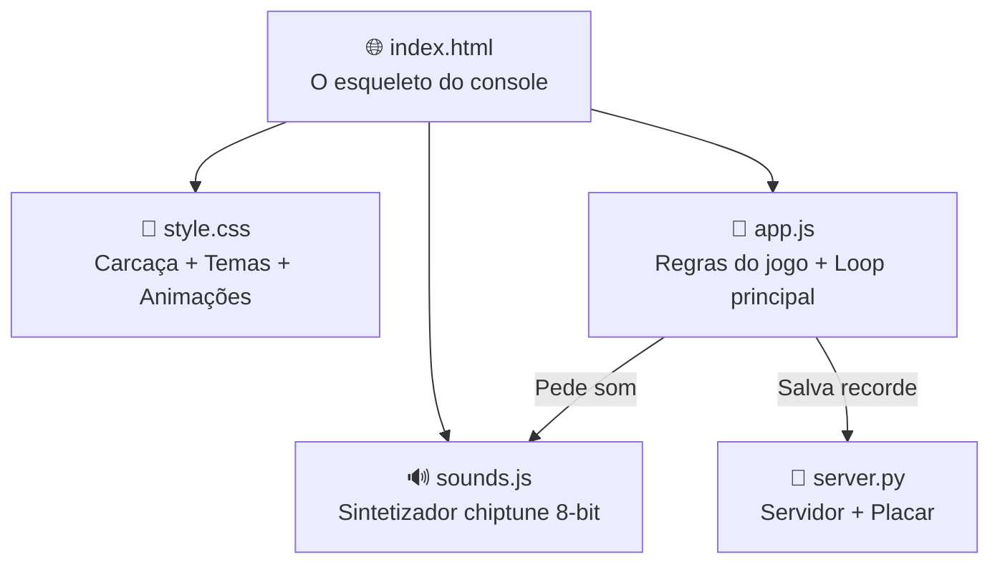
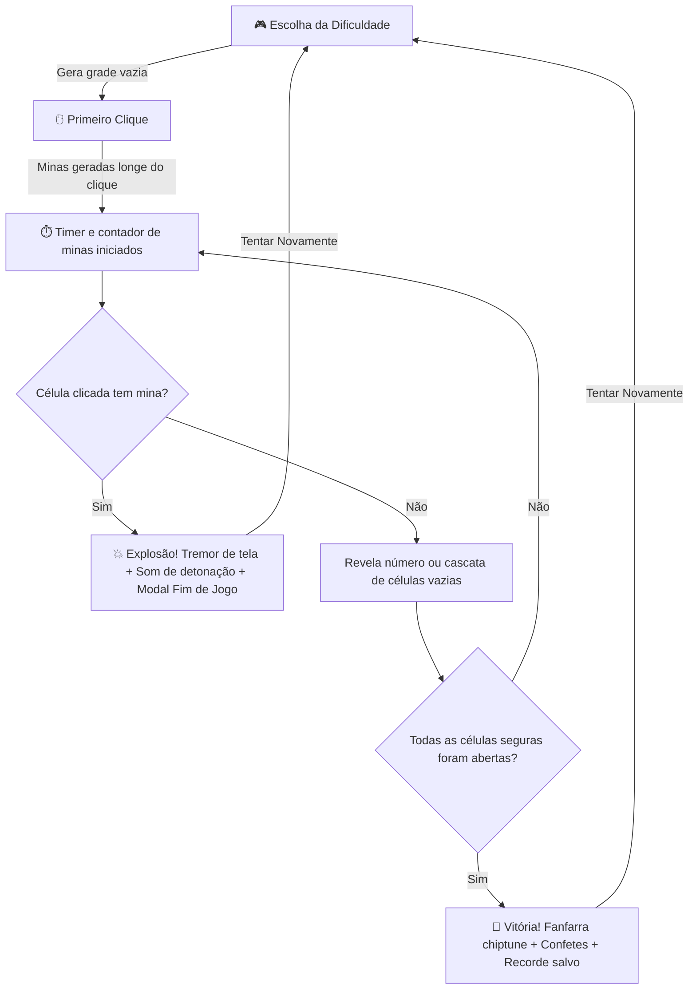

# 💣 Como Funciona o Aether-Sweeper — Explicação Simples

> Imagina que o jogo é uma **cabine de arcade retro** (fliperama). O HTML é o **chassi físico** (a caixa de madeira, a moldura do monitor, os botões e a fenda do cartucho). O CSS é a **pintura plástica e luzes neon** (deixa o gabinete estiloso e brilha de acordo com o tema). O JavaScript é o **computador interno** (controla as regras, distribui minas, calcula vizinhos e desenha os confetes). O sintetizador de áudio é o **chip de som chiptune** (gera efeitos sonoros matematicamente). O Python é o **dono do fliperama** (guarda o recorde na memória). Agora vamos ver cada parte.

---

## 📁 A Estrutura Geral — "Quem faz o quê?"



### Em palavras simples:

1. **index.html** → É o "esqueleto". Diz: "Aqui vai a tela digital de minas, aqui vai o botão Smiley, aqui vai a grade do jogo, e aqui vai o cartucho decorativo". Mas ele sozinho é estático — não faz nada.

2. **style.css** → É a "carcaça". Pega o esqueleto e diz: "O console é feito de placas de metal azul-perolado com bordas chanfradas em 45 graus, o display de LED brilha em vermelho neon sobre fundo preto, e as células do tabuleiro afundam quando clicadas". Sem ele, seriam apenas textos sem graça.

3. **app.js** → É o **cérebro**. Sabe TODAS as regras do Campo Minado: como criar o tabuleiro nas dificuldades Fácil, Médio ou Difícil, como contar minas vizinhas, quando o jogador ganha, e como acionar os confetes na tela.

4. **sounds.js** → É o **chip de som de 8-bit**. Não usa arquivos de áudio gravados (como MP3 ou WAV). Ele cria som puro gerando ondas matemáticas diretamente na placa de áudio do seu computador.

5. **server.py** → É o **banco de memória**. Serve os arquivos para o seu navegador rodar o jogo offline e persiste suas estatísticas (vitórias, derrotas e tempo recorde) em um arquivo JSON local.

---

## 🧠 O Mecanismo do Jogo (app.js) — "Como funciona o Campo Minado?"

### O Tabuleiro e as Dificuldades
O tabuleiro é uma grade de células organizadas em linhas e colunas. O jogo suporta três modos clássicos:

| Dificuldade | Tamanho da Grade | Número de Minas |
| :--- | :--- | :--- |
| **Fácil** | 9x9 (81 células) | 10 minas |
| **Médio** | 16x16 (256 células) | 40 minas |
| **Difícil** | 30x16 (480 células) | 99 minas |

### O Algoritmo de "Primeiro Clique Seguro"
Ninguém gosta de clicar no primeiro quadrado e explodir imediatamente. Para evitar isso, o Aether-Sweeper usa uma técnica de geração tardia:

```
1. Você clica na célula (linha X, coluna Y).
2. O jogo impede a criação de minas e adiciona (X, Y) e todos os seus 8 vizinhos a uma "lista proibida".
3. O jogo sorteia as coordenadas das minas no restante da grade.
4. Nenhuma mina cairá na área do seu primeiro clique.
5. O jogo calcula o número de vizinhos de cada célula e inicia o timer.
```

### Revelação em Cascata (Recursão)
Quando você clica em uma célula que tem **0 minas ao redor**, o jogo automaticamente abre todas as células adjacentes vazias até encontrar células que possuam números. Isso é feito usando recursão:

```javascript
função revelarCelula(celula):
  Se celula já está aberta ou com bandeira: retorna
  Marcar celula como aberta
  
  Se celula tem vizinhos > 0:
    Mostrar número de vizinhos
  Senão:
    Para cada celula vizinha adjacente:
      revelarCelula(vizinha) // Chama a si mesma para abrir em cadeia
```

### Chording (Varredura Rápida)
Jogadores experientes usam o *chording* para abrir o tabuleiro em segundos. 
Se você já abriu uma célula com número (exemplo: `2`) e marcou exatamente `2` bandeiras nos vizinhos dela, ao **clicar no número 2**, o jogo automaticamente revela todas as outras casas ocultas restantes ao redor dela. Se você marcou alguma bandeira errado, uma mina explodirá!

---

## 🔊 O Chip de Som (sounds.js) — "Criando som com matemática pura"

O arquivo `sounds.js` utiliza a **Web Audio API** do navegador para simular os chips de som chiptune dos anos 80 (como o Ricoh 2A03 do NES). Ele gera 4 tipos de ondas sonoras matemáticas:

```
Onda Quadrada  ┌┐┌┐  → Som áspero, metálico e nostálgico (usado na Fanfarra de Vitória).
Onda Triangular /\/\  → Som mais suave e limpo (usado para cliques de revelação e acordes).
Onda Senoidal  ~~~~  → Som puro e arredondado (usado para colocar e tirar bandeiras).
Ruído Branco   ▒▓▒▓  → Som de estática e chiado (filtrado para fazer a Explosão de Derrota).
```

### Receitas matemáticas dos efeitos sonoros:

- **Revelar Célula (`reveal`)**: Uma onda triangular curta que começa em 520Hz e cai rapidamente para 150Hz em 60 milissegundos. É um "blip" limpo de feedback.
- **Bandeira (`flag` / `unflag`)**: Uma onda senoidal curta de 30 milissegundos. A colocação usa 1200Hz caindo para 300Hz; a remoção usa 1500Hz caindo para 500Hz (um som mais agudo).
- **Varredura (`chord`)**: Dois tons rápidos de onda triangular tocados com atraso de 40ms entre eles (nota Dó a 523Hz seguida de nota Mi a 659Hz).
- **Derrota (`lose` / Explosão)**: 
  1. Cria um gerador de ruído branco (estática de rádio).
  2. Passa o som por um filtro passa-baixa (*BiquadFilter*) que começa em 800Hz e desce exponencialmente até 60Hz em 400ms (isso tira o chiado agudo e deixa um som grave de estouro).
  3. Adiciona uma onda dente de serra grave a 90Hz caindo para 30Hz para dar o tremor de subgrave físico.
- **Vitória (`win` / Fanfarra)**: Um jingle alegre em escala pentatônica maior (C5 → E5 → G5 → C6 → G5 → C6) tocado em onda quadrada para aquela assinatura típica de jogos de 8-bit.

---

## 🎨 O Gabinete e Paletas de Cores (style.css)

O estilo visual é projetado para dar profundidade física ao gabinete usando bordas tridimensionais (bevels).

- **Efeito Elevado (Raised Bevel)**: Bordas superiores brancas semitransparentes e bordas inferiores escuras simulando uma placa metálica que salta para fora da tela.
- **Efeito Afundado (Recessed Bevel)**: Inversão das bordas (escura no topo, clara no fundo) simulando telas digitais afundadas e células já abertas.

### Paletas de Cores Dinâmicas
Ao clicar na legenda no topo, o jogo atualiza as variáveis CSS globais da carcaça:

```css
/* Paleta Clássica Periwinkle (Default GBA) */
.console-container {
  --color-canvas: #7a8aba;       /* Azul acinzentado */
  --color-canvas-soft: #9fbee7;  /* Azul claro */
  --color-chrome-indigo: #3d4f97;/* Borda escura */
}

/* Paleta Arcadia (Verde Clássico Fliperama) */
.console-container.theme-emerald {
  --color-canvas: #2e5e4e;       /* Verde floresta */
  --color-canvas-soft: #76c0a6;  /* Verde menta */
  --color-chrome-indigo: #1a3b31;/* Borda escura */
}

/* Paleta Vaporwave (Midnight SP Neon) */
.console-container.theme-midnight {
  --color-canvas: #3b364d;       /* Roxo escuro */
  --color-canvas-soft: #796f94;  /* Roxo lavanda */
  --color-chrome-indigo: #201b2a;/* Borda escura */
}
```

---

## ⚡ Animações e Feedback Físico

### 💥 Tremor de Tela (Screen Shake)
Para aumentar a tensão ao explodir uma mina, o chassi da tela recebe a classe `.shake`. Uma animação CSS rotaciona e move a tela em coordenadas aleatórias muito rápidas por 400ms:

```css
@keyframes screen-shake-effect {
  0%, 100% { transform: translate(0, 0); }
  10%, 90% { transform: translate(-3px, 2px); }
  20%, 80% { transform: translate(3px, -2px); }
  30%, 50%, 70% { transform: translate(-3px, -2px); }
  40%, 60% { transform: translate(3px, 2px); }
}
```

### 🎉 Confetes de Vitória
Ao vencer, criamos um contêiner transparente sobre o jogo e geramos **60 partículas** coloridas em posições horizontais aleatórias. Uma animação CSS faz os pedaços caírem girando de cima para baixo:

```css
@keyframes confetti-fall-effect {
  0% { transform: translateY(-10px) rotate(0deg); }
  100% { transform: translateY(400px) rotate(720deg); opacity: 0; }
}
```

---

## 🐍 O Placar e Estatísticas (server.py)

Como navegadores não podem editar arquivos diretamente no disco por segurança, o jogo se comunica com um script Python em execução local:

```
[ Navegador (Frontend) ] ───( Requisições HTTP )───► [ Python Server (Backend) ]
                                                            │
                                                     ( Salva / Lê no disco )
                                                            ▼
                                                     [ scores.json ]
```

- **`GET /api/score`**: O app.js lê o arquivo `scores.json` para carregar as estatísticas e recordes assim que você abre o jogo.
- **`POST /api/score`**: Ao vencer ou perder, envia o resultado. Se for vitória, o Python atualiza o recorde apenas se o tempo atual for menor que o recorde anterior.
- **`DELETE /api/score`**: Limpa todas as estatísticas salvando um JSON zerado.
- *Fallback*: Caso o servidor Python seja desligado, o jogo armazena seus dados silenciosamente no `localStorage` do navegador para que você não perca seu progresso.

---

## 🔄 Resumo do Fluxo do Jogo


