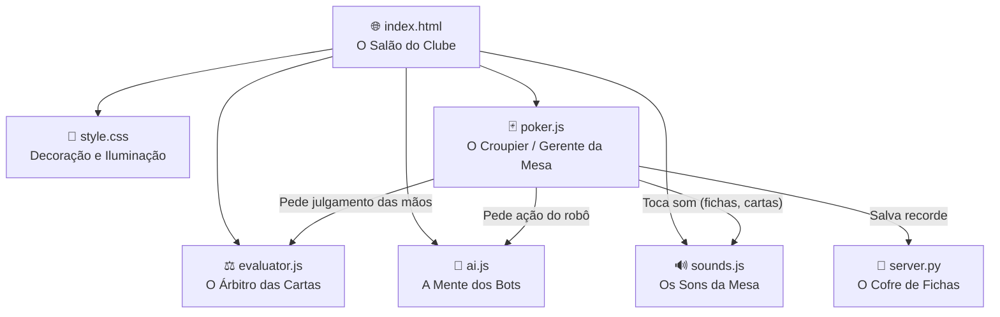
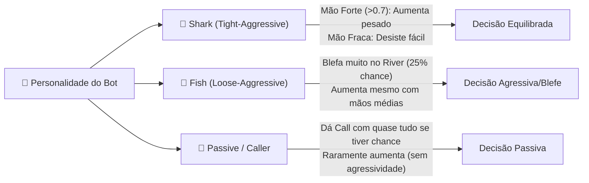

# 🃏 Como Funciona o Aether Poker — Explicação Simples

> Imagina que o jogo é um **Clube de Poker**. O HTML é o **salão físico** (a mesa de feltro, as cadeiras). O CSS é a **iluminação e decoração** (deixa tudo moderno com painéis de vidro e neon). O JavaScript se divide em três papéis: o **Croupier** (controla as rodadas e fichas), o **Árbitro** (avalia quem tem a melhor mão) e os **Bots** (os jogadores robôs). O Python é o **Cofre** (salva seus recordes). Vamos ver cada parte detalhadamente.

---

## 📂 A Estrutura Geral — "Quem faz o quê?"



### Em palavras simples:

1. **index.html** → É a estrutura física da mesa de poker. Ele posiciona os assentos dos jogadores na tela, o pote central, as cartas comunitárias e os botões de ação (Fold, Call, Raise).
2. **style.css** → É o estilo visual "Raycast". Ele cria a mesa de poker escura, as cartas com efeito 3D que giram ao serem viradas, e a transparência elegante com desfoque de fundo (*glassmorphic panels*).
3. **poker.js** → É o **Croupier**. Ele gerencia o fluxo do jogo: embaralha e distribui as cartas, cobra os blinds (apostas obrigatórias), controla de quem é a vez de falar, adiciona fichas ao pote e distribui o dinheiro para os vencedores.
4. **evaluator.js** → É o **Árbitro**. Recebe as cartas privadas e as comunitárias e descobre exatamente qual é a melhor combinação de 5 cartas de cada jogador (ex: Dois Pares, Full House, Flush) e pontua matematicamente para decidir quem ganha.
5. **ai.js** → É a **Mente dos Bots**. Controla como os robôs jogam, decidindo se eles devem correr (fold), passar (check), pagar (call) ou aumentar (raise) com base nas suas cartas, nas chances matemáticas e no seu perfil de personalidade.
6. **sounds.js** → É o **DJ da mesa**. Usa a Web Audio API para simular os sons físicos do jogo: fichas se chocando ao apostar, batidas duplas na madeira ao dar check, cartas deslizando no feltro ao dar fold e fanfarras de vitória.
7. **server.py** → É o **Banco**. Fornece a API REST local para ler, salvar e reiniciar suas maiores pilhas de fichas e histórico de vitórias/derrotas.

---

## ⚖️ O Avaliador de Mãos (evaluator.js) — "Quem ganhou a rodada?"

No Texas Hold'em, cada jogador tem 2 cartas na mão e a mesa tem 5 cartas comunitárias. O jogo de cada um é a melhor combinação de **5 cartas** dentre as 7 disponíveis. 

O arquivo [evaluator.js](../js/evaluator.js) resolve isso em três passos:

```
1. Pega as 7 cartas disponíveis (2 da mão + 5 da mesa)
2. Gera todas as combinações matemáticas possíveis de 5 cartas (são 21 combinações)
3. Avalia cada uma das combinações de 5 cartas e escolhe a que tem a maior pontuação
```

### A Pontuação em Base 16 (Hexadecimal)

Para decidir quem ganha sem gerar empates incorretos, o avaliador converte a mão em uma pontuação numérica única usando potências de 16:

$$\text{Pontuação} = (\text{Rank} \times 16^5) + (\text{Valor}_1 \times 16^4) + (\text{Valor}_2 \times 16^3) + (\text{Valor}_3 \times 16^2) + (\text{Valor}_4 \times 16^1) + (\text{Valor}_5 \times 16^0)$$

*   **Rank (0 a 9):** A força da combinação (0 = Carta Alta, 1 = Par, 2 = Dois Pares, ..., 8 = Straight Flush, 9 = Royal Flush).
*   **Valores (2 a 14):** O valor das cartas ordenado por importância de desempate (ex: Ás = 14, Rei = 13, ..., 2 = 2).

#### Exemplo prático de desempate:
Dois jogadores têm **Dois Pares** (Rank 2):
*   **Jogador A** tem Par de Reis (13) e Par de 10 (10) com Kicker Dama (12).
*   **Jogador B** tem Par de Reis (13) e Par de 10 (10) com Kicker Valete (11).

O algoritmo calcula os valores ordenados por tamanho do grupo:
*   **Jogador A score:** $2 \times 16^5 + 13 \times 16^4 + 13 \times 16^3 + 10 \times 16^2 + 10 \times 16^1 + 12 \times 16^0 = 2.990.220$
*   **Jogador B score:** $2 \times 16^5 + 13 \times 16^4 + 13 \times 16^3 + 10 \times 16^2 + 10 \times 16^1 + 11 \times 16^0 = 2.990.219$

Como $2.990.220 > 2.990.219$, o **Jogador A** vence o pote!

---

## 🧠 A Inteligência dos Bots (ai.js) — "Como os robôs tomam decisões?"

O arquivo [ai.js](../js/ai.js) define as ações dos bots usando dois fatores principais: a **Força Absoluta da Mão** (Hand Strength), os **Preços do Pote** (Pot Odds) e a sua **Personalidade**.

### 1. Cálculo de Força da Mão (Hand Strength)
*   **Pre-flop:** Sem cartas comunitárias na mesa, o bot avalia suas 2 cartas da mão. Um par na mão dá um bônus alto; cartas do mesmo naipe (*suited*) ganham um pequeno bônus, e cartas de valores altos recebem peso maior.
*   **Pós-flop (Flop, Turn, River):** O bot roda o avaliador e converte o resultado em uma força de 0.0 (pior mão possível, carta alta baixa) a 1.0 (melhor mão, Royal Flush).

### 2. Cálculo dos Preços do Pote (Pot Odds)
O bot calcula o risco financeiro: quanto custa pagar em relação ao tamanho total do pote que ele pode ganhar.

$$\text{Pot Odds} = \frac{\text{Valor para dar Call}}{\text{Pote Atual} + \text{Valor para dar Call}}$$

Se a **Força da Mão** do bot for maior que as **Pot Odds**, matematicamente vale a pena pagar a aposta porque o retorno esperado no longo prazo é positivo.

### 3. Perfis de Personalidade dos Bots



---

## 💰 Resolução de Potes Paralelos (Side Pots) — "E se alguém for All-in com poucas fichas?"

Um dos problemas mais complexos do Poker de mesa é quando um jogador fica sem fichas (All-in) e outros jogadores que têm mais fichas continuam apostando entre si.

O Aether Poker resolve isso de forma perfeita em [poker.js](../js/poker.js#L943) usando o **Algoritmo de Potes Paralelos Reais**:

```
1. Guarda a contribuição total de fichas de cada jogador na rodada.
2. Identifica os jogadores que não correram (showdown candidates).
3. Enquanto houver fichas apostadas no pote:
    a. Seleciona quem tem a melhor mão entre os elegíveis.
    b. Encontra a menor contribuição (limite) entre os vencedores desta etapa.
    c. Recolhe essa quantia limite de TODOS os jogadores que apostaram na rodada.
    d. Distribui esse sub-pote acumulado entre os vencedores da etapa.
    e. Subtrai o valor recolhido do saldo de apostas de cada um e repete o processo.
```

Desta forma, se você tiver apenas \$100 de fichas e for All-in, e seus oponentes apostarem \$500, você só competirá pelo pote de \$100 de cada jogador. O restante (\$400 de cada oponente) é colocado em um pote paralelo disputado apenas entre os adversários com mais fichas, garantindo a integridade matemática do jogo.
