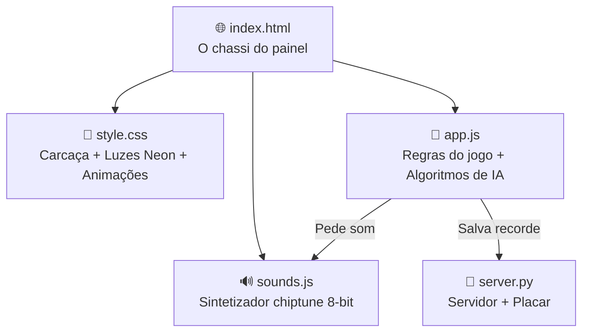
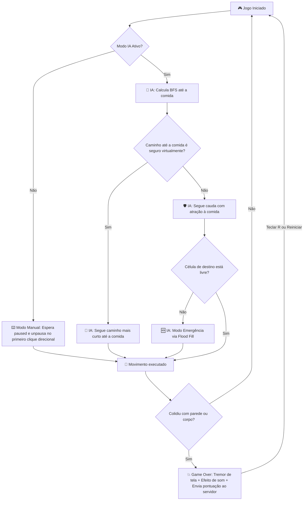

# 🐍 Como Funciona o Aether Snake — Explicação Simples

> Imagina que o jogo é uma **cabine de arcade retro** (fliperama) dedicada à simulação de IA. O HTML é o **chassi físico** (o painel de controle, a moldura do display e a grade quadriculada). O CSS é a **pintura e luzes neon** (as paletas cibernéticas, brilhos intensos de LED e efeitos pulsantes). O JavaScript é o **computador interno** contendo a mente da cobra (calculando rotas seguras, prevendo encurralamentos e detectando colisões). O sintetizador de áudio é o **chip de som chiptune** (gerando efeitos sonoros matematicamente). O Python é o **dono do fliperama** (registrando as pontuações máximas). Vamos detalhar cada parte.

---

## 📁 A Estrutura Geral — "Quem faz o quê?"



### Em palavras simples:

1. **index.html** → É o "esqueleto" e painel de botões. Diz: "Aqui fica a tela digital de jogo, aqui as chaves seletoras de velocidade, o interruptor para ligar a IA, e o placar eletrônico".
2. **style.css** → É a "carcaça estilosa". Define o fundo escuro `#07080a` típico do Raycast, faz o cabeçalho pulsar, desenha os botões físicos e adiciona uma aura brilhante de neon ao corpo da cobra.
3. **app.js** → É o **cérebro e cérebro artificial**. Nele roda o motor do jogo e as rotas da Inteligência Artificial (BFS, simulação virtual de escape de cauda e Flood Fill).
4. **sounds.js** → É o **chip de som de 8-bit**. Ele gera ondas matemáticas senoidais, triangulares e ruídos diretamente através da placa de som utilizando a Web Audio API.
5. **server.py** → É o **banco de memória**. Serve os arquivos para o jogo rodar localmente e persiste seus recordes de pontuação e blocos em um arquivo JSON.

---

## 🧠 O Motor da IA (app.js) — "Como a cobra pensa?"

Para que a IA sobreviva no tabuleiro de $20 \times 20$ sem cometer suicídio, ela utiliza 4 etapas lógicas em milissegundos a cada tick de jogo:

### 1. Rota mais Curta até a Comida (BFS)
A cobra tenta traçar o caminho mais curto até a fruta usando o algoritmo **BFS (Busca em Largura)**. O BFS explora todas as células vizinhas em camadas circulares, garantindo a rota mais curta e sem colisões com seu próprio corpo.

### 2. Simulação Virtual de Segurança (Virtual Safety Check)
Ir direto para a comida pode ser uma armadilha. Se a cobra comer a fruta mas ficar encurralada em um beco sem saída formado por seu próprio corpo, ela morrerá.
Para evitar isso, ela executa uma simulação mental:
- Cria um clone virtual da cobra.
- Move o clone virtual ao longo de todo o caminho do BFS até comer a fruta virtual.
- No estado final, ela roda outro BFS do **cabeção virtual** até a **cauda virtual**.
- Se a cauda simulada ainda for alcançável, o caminho original é considerado **seguro** e executada. Caso contrário, ela recusa a comida temporariamente.

### 3. Seguimento Inteligente de Cauda (Tail-Following)
Se não há rota segura para comer, ela passa a **seguir a própria cauda**. Como a cauda está constantemente se movendo e desocupando blocos, segui-la garante que a cobra circule em segurança sem colidir.
Para evitar ficar rodando em um círculo estável eterno sem nunca comer a comida, o vizinho para seguir a cauda é selecionado usando esta fórmula de pontuação:
$$\text{Score} = \text{Espaço Livre (Flood Fill)} \times 10000 - \text{Distância Manhattan até a Comida} \times 100 + \text{Distância até a Cauda}$$

- **Espaço Livre**: Garante que ela sempre prefira o caminho com maior espaço aberto.
- **Proximidade da Comida**: Atrai e distorce o círculo de segurança em direção à fruta. Assim que a fruta fica ao alcance e em uma rota segura de escape, a IA quebra o círculo e vai comer.
- **Distância da Cauda**: Desempate que mantém a cabeça o mais distante possível da cauda.

### 4. Modo Sobrevivência de Emergência
Se tudo falhar (comida e cauda inacessíveis), ela entra em pânico. Para postergar a morte ao máximo, ela analisa todas as direções e se move na célula livre que contiver a maior área livre conectada usando **Flood Fill**.

---

## 🔊 O Chip de Som (sounds.js) — "Criando chiptunes matemáticos"

A generation de som é 100% sintetizada em tempo real (sem carregar áudios de fora). Ela modela osciladores da **Web Audio API**:

```
Onda Quadrada  ┌┐┌┐  → Som ríspido e metálico (efeito de clique nos botões).
Onda Triangular /\/\  → Som suave e limpo (feedback de pausa e retomada).
Onda Senoidal  ~~~~  → Som arredondado puro (arpejo alegre ao comer a fruta).
Ruído Branco   ▒▓▒▓  → Chiado de estática (filtrado para dar o estrondo de explosão).
```

### Efeitos sonoros projetados:
- **Comer Fruta (`Eat`)**: Um arpejo ascendente senoidal de duas notas curtas (Nota C5 a 523Hz seguida de Nota E5 a 659Hz) gerando um tom festivo e satisfatório.
- **Colisão (`Crash`)**: Um estouro grave simulado combinando um gerador de ruído com um filtro passa-baixas (*BiquadFilter*) que desce de 1000Hz para 40Hz em 350ms, removendo o chiado e gerando um impacto abafado.
- **Pausa / Retomar**: Cliques de onda triangular com frequências alternadas.

---

## 🎨 Carcaça e Temas Visuais (style.css)

O gabinete do jogo possui 4 pinturas e acentos de iluminação dinâmicos (selecionáveis no painel esquerdo):

| Tema | Estilo Visual | Efeito Especial |
| :--- | :--- | :--- |
| **Neon Glow (Moderno)** | Moderno minimalista | Cabeça branca com rastro verde neon e sombras brilhantes. |
| **Retro Arcade (Verde)** | Clássico de 8-bit | Segmentos verdes planos delimitados por grades escuras de CRT. |
| **Cyberpunk (Rosa/Ciano)** | Futurista neon | Rastro de cor magenta gradiente a azul neon e partículas de faísca amarelas. |
| **Classic Block (Sólido)** | Design plano limpo | Blocos sólidos cinzas e brancos sem efeitos de luz adicionais. |

---

## 🐍 O Placar e Estatísticas (server.py)

O jogo utiliza uma integração assíncrona simples com o servidor central para manter o placar dinâmico:

```
[ Frontend (Navegador) ] ───( Requisição POST /api/score?game=snake )───► [ Central Server ]
                                                                                │
                                                                         ( Persiste no disco )
                                                                                ▼
                                                                         [ scores_db.json ]
```

- **Estatísticas Persistidas**: Pontuação máxima (`pontuacao_maxima`), comprimento máximo de blocos (`comprimento_maximo`) e número total de simulações realizadas (`partidas_jogadas`).
- **Dashboard Consolidado**: Os dados são lidos pelo portal principal de jogos para calcular as vitórias e partidas totais da suíte consolidada de jogos.

---

## 🔄 Fluxo de Decisões do Jogo


