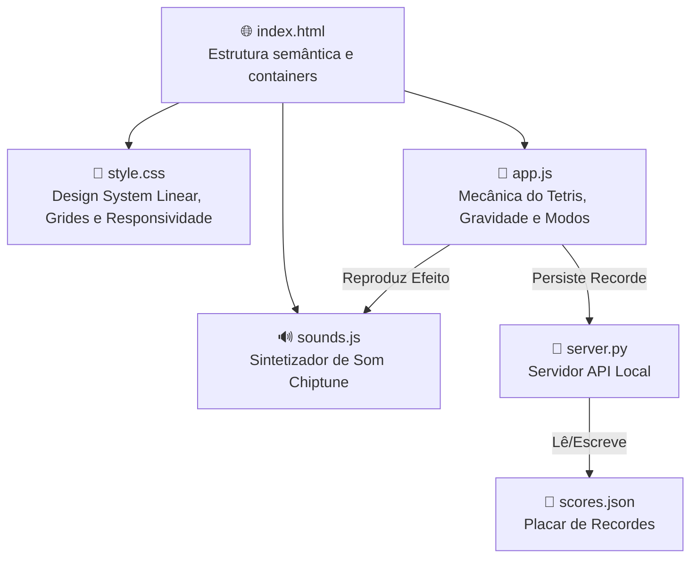

# 🌌 Como Funciona o Aether Tetris — Explicação do Sistema

> O **Aether Tetris** foi desenvolvido para ser uma experiência moderna, premium e imersiva. Ele utiliza a estética visual refinada da **Linear.app** (dark-mode com detalhes roxo-lavanda) e combina animações fluidas baseadas em Canvas HTML5, áudio gerado por síntese matemática (Web Audio API) e persistência de dados local via Python.
>
> Este documento explica o papel e o funcionamento técnico de cada componente do sistema.

---

## 📁 Estrutura de Componentes

### Divisão de Responsabilidades:

1. **`index.html`**: Fornece o esqueleto semântico da aplicação, definindo as áreas de exibição do tabuleiro (Canvas), os painéis de visualização da peça reserva (Hold) e próxima peça (Next), os mostradores de pontuação e os botões de toque para dispositivos móveis.
2. **`css/style.css`**: Define a identidade visual inspirada na Linear.app. Aplica a paleta de cores escura (`#010102`), bordas finas (`#23252a`), o roxo-lavanda (`#5e6ad2`) como acento, e cuida do comportamento responsivo para que o jogo se adapte de desktops de alta resolução até smartphones pequenos (como iPhone SE).
3. **`js/app.js`**: Contém toda a máquina de estados e física do Tetris: loop gravitacional, rotações SRS, colisões, pontuação clássica, hold, projeção de sombra (ghost piece) e seleção de modos de jogo.
4. **`js/sounds.js`**: Controla a Web Audio API do navegador. Em vez de carregar arquivos de som estáticos (como `.mp3` ou `.wav`), ele sintetiza som em tempo real criando e modulando ondas sonoras.
5. **`server.py`**: Um servidor web local leve escrito em Python que serve os arquivos estáticos e expõe uma API RESTful para gerenciar o placar.
6. **`scores.json`**: Um arquivo JSON simples onde os recordes são salvos e persistem entre as inicializações.

---

## 🧠 A Lógica do Jogo (`app.js`)

A mecânica do Tetris opera sobre uma grade virtual de **10 colunas por 20 linhas**.

### 1. Sistema Randomizer (7-Bag)
Para evitar que o jogador receba sequências infinitas do mesmo bloco ou sofra com a ausência prolongada da peça "I" (linha), o jogo utiliza o algoritmo **7-Bag Randomizer**. O motor cria um "saco" contendo uma unidade de cada uma das 7 peças clássicas, embaralha-o usando o algoritmo Fisher-Yates, e consome as peças dele. Um novo saco só é gerado quando o anterior esvaziar. Isso garante que a distância máxima entre duas peças iguais nunca seja maior que 12 jogadas.

### 2. Modos de Jogo
O Aether Tetris oferece três modos distintos:
*   **Clássico**: O jogo padrão. A velocidade de queda aumenta progressivamente (nível aumenta a cada 10 linhas limpas). Se os blocos atingirem o topo da grade, o jogo termina.
*   **Contrarrelógio (Time Attack)**: Uma corrida de velocidade pura. O jogador começa com um objetivo de limpar **40 linhas**. O cronômetro conta o tempo e a partida acaba em vitória assim que o contador de linhas restantes chega a zero. O recorde é o menor tempo gasto.
*   **Zen**: Modo relaxante. O jogo roda no Nível 1 fixo. Se a pilha de blocos atingir o topo, o tabuleiro apaga automaticamente sua metade superior para que o jogador continue indefinidamente, sem estresse ou Game Over.

### 3. SRS (Super Rotation System) Simplificado
Em jogos de Tetris clássicos, tentar girar uma peça encostada na parede resulta em falha porque não há espaço físico na grade. No Aether Tetris, implementamos um sistema de **Wall Kicks** (chutes na parede): quando o jogador gira uma peça e ocorre colisão, o motor testa deslocamentos rápidos (1 casa para a esquerda, 1 para a direita, 1 para cima, ou 2 casas para os lados no caso da peça I). Se encontrar uma posição segura, a peça é rotacionada e deslocada instantaneamente.

### 4. Projeção de Queda (Ghost Piece)
Para auxiliar o jogador, o motor simula continuamente a descida da peça ativa até que ela colida com o fundo ou com blocos fixados. Essa posição é renderizada no tabuleiro como um contorno fino translúcido (sombra), indicando exatamente onde a peça pousará se um **Hard Drop** (Queda Rápida) for executado.

---

## 🔊 Sintetizador de Áudio (`sounds.js`)

Todos os efeitos sonoros do Aether Tetris são sintetizados usando ondas matemáticas geradas pela **Web Audio API**:

*   **Movimento (Move)**: Onda triangular curta (`0.06s`) com decaimento exponencial de frequência rápido (de `120Hz` para `80Hz`). Produz um impacto físico de baixa frequência ("thud").
*   **Rotação (Rotate)**: Onda senoidal curta (`0.08s`) com rampa de frequência ascendente rápida (de `300Hz` para `420Hz`). Cria um som de feedback mecânico leve ("swish").
*   **Fixação (Lock-down)**: Onda triangular de `0.12s` de baixa frequência (de `90Hz` para `40Hz`) para indicar peso ao fixar a peça.
*   **Limpeza de Linha (Line Clear)**: Um arpejo ascendente de 3 notas curtas tocadas em sequência rápida com onda quadrada (Notas C5, E5 e G5), no melhor estilo chiptune 8-bit.
*   **Tetris (4 Linhas)**: Um arpejo de 4 notas (C5, E5, G5, C6) acoplado a um gerador de **Ruído Branco** filtrado por passa-baixa, criando o efeito de uma explosão comemorativa.
*   **Game Over**: Uma sequência descendente de 4 notas tristes com pitch-bend descendente (G4, F4, D#4, C4), indicando fracasso.

---

## 🎨 Design System e Interface (`style.css`)

O design é construído com foco na clareza técnica e na sofisticação da Linear.app:

*   **Gradients Modernos**: Os blocos do Tetris usam gradientes lineares de cor para cinza escuro, simulando volume 3D suave, finalizados com uma borda interna semitransparente brilhante (`rgba(255, 255, 255, 0.18)`), que destaca os cantos arredondados na tela.
*   **Screen Shake (Tremor)**: Executar um Hard Drop ou fazer um Tetris aciona a classe `.shake` na moldura do tabuleiro, movendo a tela em posições aleatórias rápidas para dar feedback físico de impacto.
*   **Responsividade em 3 Breakpoints**:
    1.  **Desktop (>1024px)**: Layout completo em 3 colunas. O tabuleiro fica ao centro com Hold na esquerda e Next/Pontuação na direita.
    2.  **Tablet (<=1024px)**: Os painéis Hold e Next se reposicionam no topo lado a lado. As estatísticas migram para a parte inferior e os **botões de toque** móveis surgem para jogabilidade em tela sensível ao toque.
    3.  **Mobile (<480px)**: A grade do tabuleiro encolhe proporcionalmente para caber em displays pequenos sem quebrar o layout. Os botões de toque reorganizam-se para facilitar o alcance dos polegares.

---

## 🐍 O Backend e Persistência (`server.py`)

O script Python atua como um servidor HTTP de desenvolvimento e API de dados:

*   **API REST**:
    *   `GET /api/score`: Retorna o JSON com o placar de recordes atualizados.
    *   `POST /api/score`: Recebe o resultado da partida. Se for o modo Clássico, verifica se quebrou o recorde de pontuação máxima ou linhas máximas. Se for o modo Contrarrelógio e o jogador venceu, atualiza o tempo recorde se ele for menor que o recorde anterior.
    *   `DELETE /api/score`: Restaura o arquivo `scores.json` para o estado zerado.
*   **Mecanismo de Tolerância a Falhas (Offline First)**: Se o jogador rodar o arquivo `index.html` abrindo diretamente pelo arquivo (sem iniciar o `server.py`), o JavaScript detecta a indisponibilidade da API REST e redireciona a persistência silenciosamente para o **`localStorage`** do navegador. O jogo permanece 100% funcional!
