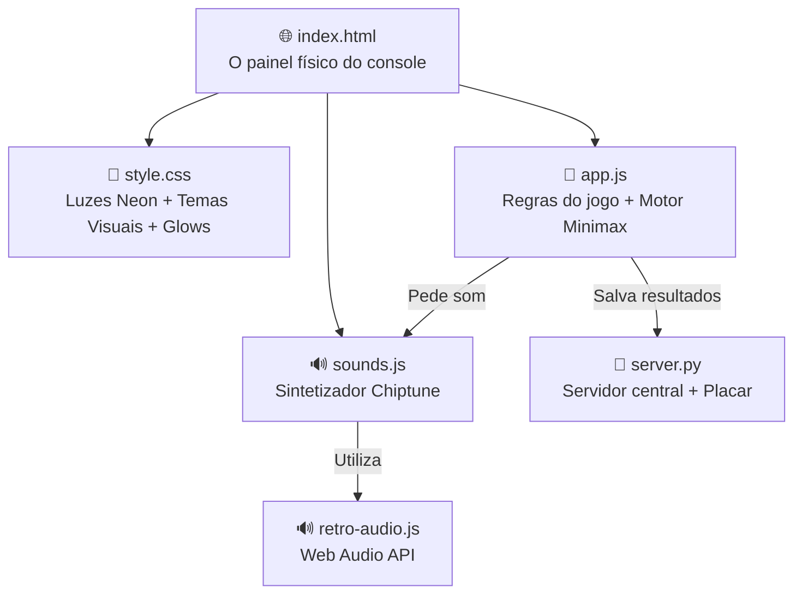
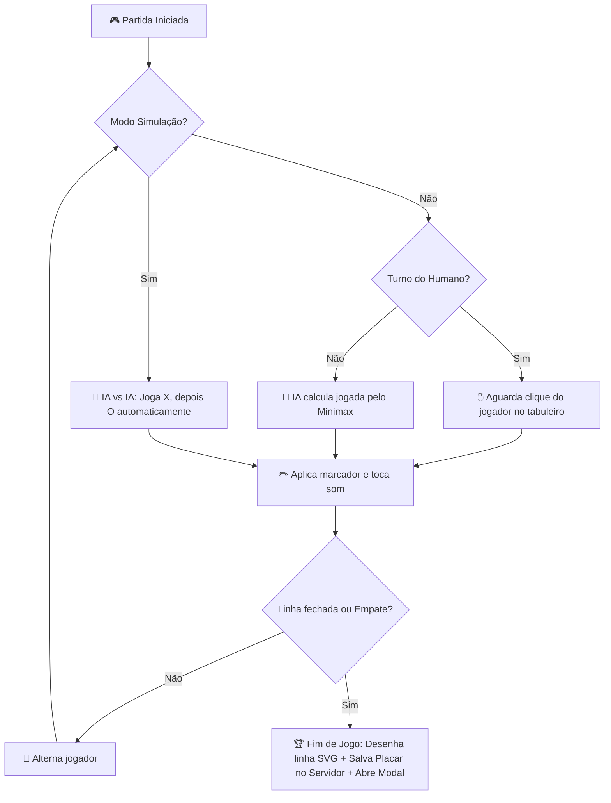

# ❌ Como Funciona o Aether Tic-Tac-Toe — Explicação Simples

> Imagina que o jogo é uma **cabine de fliperama retro (arcade)** voltada ao duelo clássico de inteligência artificial. O HTML é a **carcaça física** (o painel de controle, os botões e o display digital). O CSS é a **pintura neon e iluminação** (os halos brilhantes de X e O, os temas selecionáveis e as animações de tremor). O JavaScript é o **computador interno** (calculando todas as árvores de possibilidades via Minimax, aplicando cortes matemáticos de busca e gerenciando os estados). O sintetizador de áudio é o **chip de som retro** (Web Audio API gerando oscilações senoidais e quadradas sob demanda). O Python no backend atua como o **banco de recordes** (salvando as estatísticas consolidadas). Vamos detalhar cada parte.

---

## 📁 A Estrutura Geral — "Quem faz o quê?"

1. **index.html** → Define onde fica o tabuleiro digital 3x3, a barra de diagnóstico (tempo de cálculo, nós analisados), e as chaves de velocidade e temas no painel esquerdo.
2. **style.css** → Aplica a estética de vidro (glassmorphism), desenha as marcas X (magenta) e O (ciano) com sombras projetadas em neon, e realiza animações de entrada e vitória.
3. **app.js** → Controla o ciclo de jogo, verifica combinações de vitória, desenha a linha de finalização via SVG, e roda a IA com o algoritmo Minimax.
4. **sounds.js** → Mapeia osciladores e ondas da Web Audio API para tocar tons diferenciados para X (agudo) e O (suave), arpejos alegres na vitória e escalas tristes na derrota.
5. **server.py** → Persiste os resultados de vitórias, derrotas e empates no arquivo `scores_db.json`.

---

## 🧠 O Motor da IA (app.js) — "Como a IA pensa?"

O jogo da velha possui $3^9 = 19.683$ possíveis preenchimentos de tabuleiro, e apenas $255.168$ caminhos de partidas válidas. O Minimax consegue esgotar todo o jogo instantaneamente.

### 1. Árvore de Decisão Recursiva (Minimax)
O algoritmo assume que ambos os jogadores jogam de forma otimizada. Quando é a vez da IA, ela busca:
- **Maximizar** sua pontuação final.
- Assumir que o humano tentará **Minimizar** a pontuação da IA.

Ela atribui valores para os estados terminais:
* **Vitória da IA:** $+10 - \text{profundidade}$ (prefere caminhos mais rápidos para vencer).
* **Derrota da IA:** $-10 + \text{profundidade}$ (tenta adiar a derrota o máximo possível).
* **Empate:** $0$.

### 2. Poda Alpha-Beta (Alpha-Beta Pruning)
Para otimizar o tempo de varredura das jogadas, a IA carrega dois limites dinâmicos:
* **Alpha ($\alpha$):** A melhor escolha já garantida para o jogador Maximizador.
* **Beta ($\beta$):** A melhor escolha já garantida para o jogador Minimizador.

Ao percorrer a árvore de decisão, se a IA descobre um ramo onde $\beta \leq \alpha$, ela aborta a busca nesse galho (poda), economizando CPU. O cálculo leva menos de **1ms** em navegadores modernos.

### 3. Níveis de Dificuldade
* **Fácil (Easy):** A IA escolhe jogadas 100% aleatórias dentre as células vazias.
* **Médio (Medium):** A cada turno, há 50% de chance de usar a melhor decisão do Minimax e 50% de chance de cometer uma falha jogando aleatório.
* **Impossível (Impossible):** Minimax perfeito em 100% dos turnos. É impossível vencer a IA (apenas empates ou derrotas são possíveis).

---

## 🔊 Sintetizador de Som (sounds.js) — "Chiptunes em Tempo Real"

Todo áudio é matemático e dinâmico, sem arquivos externos:

* **Jogada do X (`playMoveX`)**: Onda quadrada (`square`) de frequência 440Hz subindo rápido para 550Hz. Dá um som metálico e agressivo.
* **Jogada do O (`playMoveO`)**: Onda triangular (`triangle`) caindo de 330Hz para 220Hz. Dá um tom macio e eletrônico.
* **Vitória (`playWin`)**: Arpejo maior ascendente em Dó Maior (C5, E5, G5, C6) com notas espaçadas em 60ms.
* **Derrota (`playLoss`)**: Arpejo menor descendente (F4, D4, C4, A3) com tempo maior de sustentação (120ms) e decaimento exponencial.
* **Empate (`playDraw`)**: Cliques mecânicos gêmeos de baixa frequência imitando relés elétricos.

---

## 🎨 Temas Cromáticos (style.css)

| Tema | Fundo | Marcadores X / O | Estilo |
| :--- | :--- | :--- | :--- |
| **Cyberpunk** | Escuro Raycast | Rosa Magenta / Azul Ciano | Neon pulsante com muito brilho e contraste de cor. |
| **Neon Glow** | Roxo Aether | Violeta Claro / Azul Celeste | Tons frios e degradês suaves simulando vidro acetinado. |
| **Retro Arcade**| Verde Fósforo | Verde Brilhante / Laranja Amber | Estilo terminal CRT retro com brilho característico de fósforo. |
| **Glass Sólido** | Cinza Fosco | Branco Puro / Cinza Muted | Limpo, minimalista, sem efeitos exagerados de glow de neon. |

---

## 🔄 Fluxo de Decisão do Jogo

